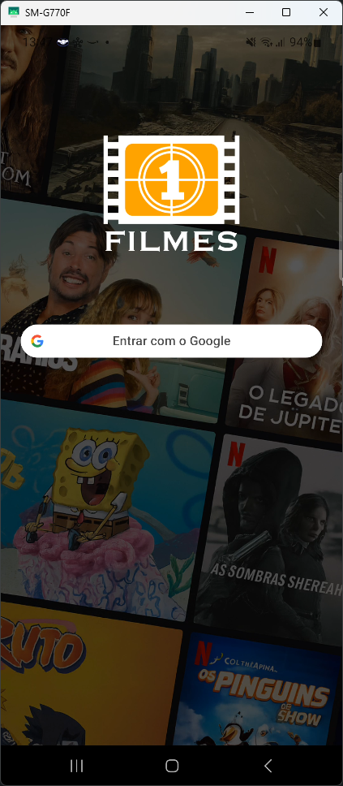
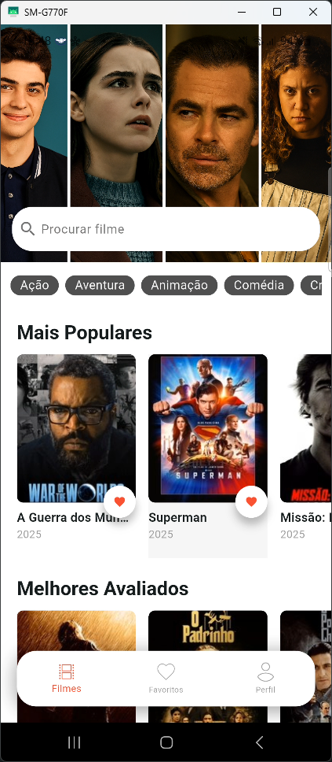
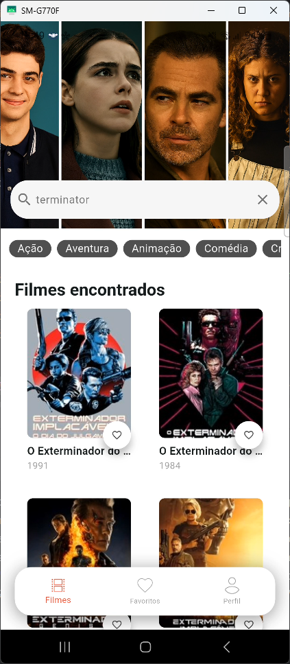
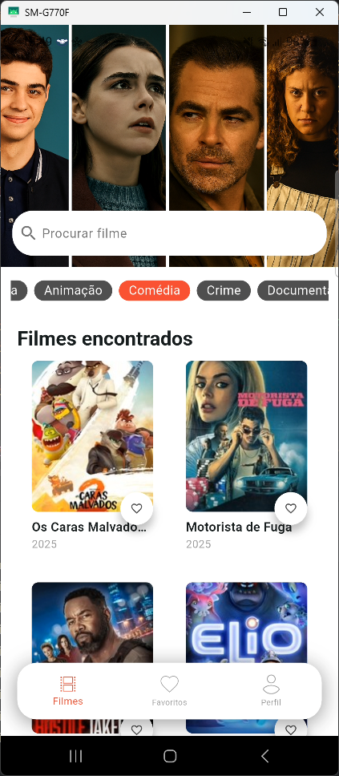
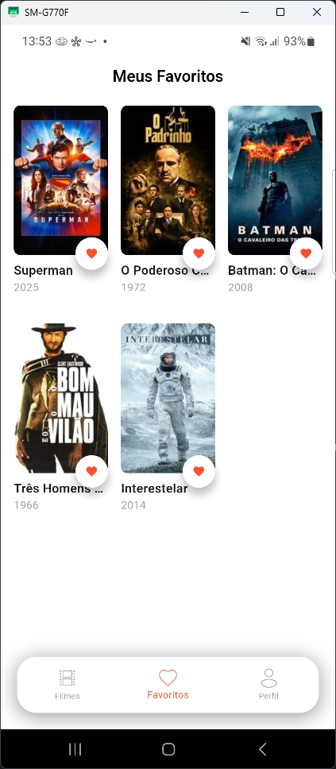

# 🎬 Cinebox

<div align="center">
  

<p align="center">
    <strong>Sua experiência cinematográfica na palma da mão</strong>
  </p>

<p align="center">
    
    
    
    
  </p>

<p align="center">
    
    
    
  </p>
</div>

---

## 📖 Sobre o Projeto

O **Cinebox** é um aplicativo móvel desenvolvido em Flutter que oferece uma experiência completa para amantes
do cinema e que usa como fonte de dados a API do [The Movie Database - TMDB](https://www.themoviedb.org/) .
Descubra novos
filmes, acompanhe suas avaliações, monte sua lista de favoritos e mantenha-se
atualizado com os últimos lançamentos do mundo cinematográfico.

### ✨ Funcionalidades Principais

- 🔍 **Busca Avançada**: Encontre filmes por título ou gênero
- ⭐ **Avaliações**: Veja avaliações da comunidade e críticos especializados
- 📚 **Listas Personalizadas**: Crie e gerencie suas listas de filmes favoritos
- 📱 **Interface Intuitiva**: Design moderno e responsivo para uma navegação fluida

## 📱 Screenshots

<div align="center">
  
  
  
  
  
  
</div>

## 🛠️ Tecnologias Utilizadas

### Frontend

- **Flutter** 3.35 - Framework UI multiplataforma
- **Dart** 3.9 - Linguagem de programação
- **Riverpod** - Gerenciamento de estado
- **Dio** - Cliente HTTP para comunicação com APIs
- Retrofit -
- Google SignIn -
- Json Annotation -
- **Cached Network Image** - Cache e carregamento otimizado de imagens
- **Shared Preferences** - Armazenamento local de dados

### APIs e Serviços

- **TMDB API** - Base de dados de filmes
- **Firebase** (opcional) - Autenticação e armazenamento na nuvem

### Arquitetura

- **Clean Architecture** - Separação clara de responsabilidades
- **MVVM Pattern** - Model-View-ViewModel
- **Dependency Injection** - Injeção de dependências

## 🚀 Como Executar o Projeto

### Pré-requisitos

- Flutter SDK 3.24.x ou superior
- Dart SDK 3.5.x ou superior
- Android Studio / VS Code
- Git

### Instalação

1. **Clone o repositório**

   ```bash
   git clone https://github.com/seuusuario/cinebox.git
   cd cinebox
   ```
2. **Instale as dependências**

   ```bash
   flutter pub get
   ```
3. **Configure as variáveis de ambiente**

   Crie um arquivo `.env` na raiz do projeto:

   ```env
   TMDB_API_KEY=sua_chave_da_api_tmdb
   FIREBASE_PROJECT_ID=seu_projeto_firebase
   ```
4. **Execute o aplicativo**

   ```bash
   # Para Android
   flutter run --dart-define-from-file=.env

   # Para iOS
   flutter run --dart-define-from-file=.env -d ios
   ```

### Gerando APK/IPA
